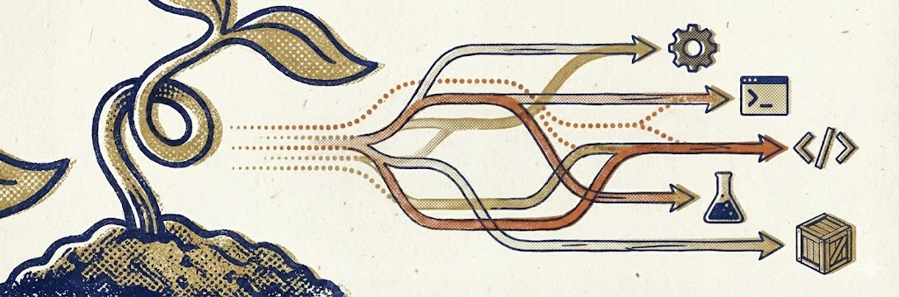

# Project Template

A Claude Code project template with interactive initialization.

## Getting Started

1. **Clone this repository**
   ```bash
   git clone <template-url> my-project-name
   cd my-project-name
   ```

2. **Remove the template's git history** (optional, for fresh start)
   ```bash
   rm -rf .git
   git init
   ```

3. **Open with Claude Code**
   ```bash
   claude
   ```

4. **Run the initialization command**
   ```
   /init
   ```

## What Happens During Initialization

Claude will conduct a brief interview about your project:

- **Project Identity** - Name, description, target users
- **Technical Stack** - Language, framework, database, services
- **Development Workflow** - Branching, testing, linting preferences
- **Collaboration Style** - How you want Claude to work with you

Based on your answers, Claude generates:

**Scaffolding:**
- Customized `CLAUDE.md` with project-specific guidance
- Updated `README.md` with setup instructions
- Stack-specific `.gitignore` patterns
- Directory structure matching your project type
- Minimal starter code scaffolding

**Claude Code Tooling:**
- **Agents** (`.claude/agents/`) — Specialized review agents (code, security, architecture) with stack-specific prompts, plus a test runner agent if testing is enabled
- **Skills** (`.claude/skills/`) — Reusable processes for documenting solutions, setting up the dev environment, and testing conventions
- **Commands** (`.claude/commands/`) — Workflow commands (`/plan`, `/review`, `/compound`, `/work`, `/test`) that orchestrate agents and skills into a complete development loop

## Template Contents

```
project-template/
├── .claude/
│   ├── settings.json
│   └── commands/
│       └── init.md          # The initialization command
├── docs/
│   ├── plans/               # Implementation plans
│   ├── solutions/           # Documented solutions
│   └── workflows/           # Reference workflows
├── CLAUDE.md                # Project context for Claude
├── AGENTS.md                # Agent working guidelines
└── README.md                # This file
```

After initialization, the `.claude/` directory expands to include:
```
.claude/
├── settings.json
├── agents/
│   ├── review/
│   │   ├── code-reviewer.md
│   │   ├── security-reviewer.md
│   │   └── architecture-reviewer.md
│   └── workflow/
│       └── test-runner.md       # If testing enabled
├── skills/
│   ├── compound-docs/SKILL.md
│   ├── project-setup/SKILL.md
│   └── testing/SKILL.md         # If testing enabled
└── commands/
    ├── plan.md
    ├── review.md
    ├── compound.md
    ├── work.md
    └── test.md                  # If testing enabled
```

## Philosophy

This template is built on the [compound engineering](https://github.com/EveryInc/compound-engineering-plugin) philosophy: **each unit of engineering work should make subsequent units easier, not harder.**

Rather than accumulating technical debt where every feature adds complexity, compound engineering treats knowledge capture as a first-class activity. The core loop is:

**Plan → Work → Review → Compound → Repeat**

This template provides the scaffolding for that loop:

| Directory | Purpose |
|-----------|---------|
| `docs/plans/` | Think before you code. Plans live here before execution. |
| `docs/workflows/work.md` | Execute systematically with incremental commits. |
| `docs/workflows/review.md` | Review to catch issues *and* capture learnings. |
| `docs/solutions/` | Document solved problems so they compound over time. |
| `CLAUDE.md` "Key Learnings" | Project-level knowledge that grows with every session. |

The compound-engineering-plugin itself is a full-featured Claude Code plugin with 28 specialized agents, 15 skills, multi-agent parallel reviews, and git worktree management. This template takes the same foundational ideas and provides them as a lightweight, stack-agnostic starting point that any project can grow from.

## After Initialization

The `/init` command archives itself to `docs/archive/` after completing setup. Your project is then ready for development with Claude Code.
